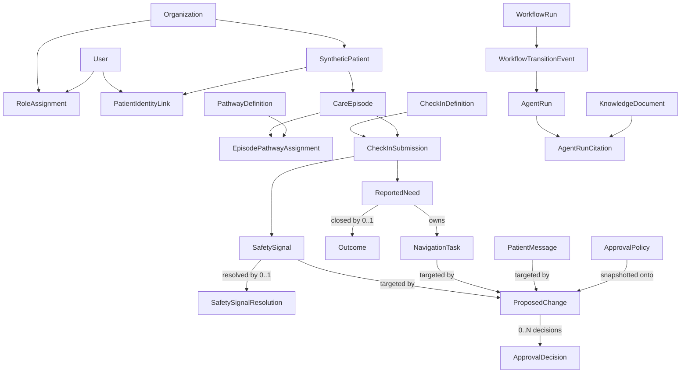

# Oncology Journey Command Center

**Product design specification**

**Date:** August 18, 2026

**Status:** Reconciled architecture awaiting stakeholder review

**Target:** Public portfolio release in four weeks, with up to two optional refinement weeks

## 1. Executive summary

The Oncology Journey Command Center is a two-sided care-navigation application for people receiving active breast cancer treatment and the nurse navigators who support them between visits.

Patients complete short, adaptive check-ins about symptoms, medication questions, distress, upcoming visits, and practical barriers. The system converts those reports into structured needs, applies deterministic safety rules, invokes narrow AI agents for bounded reasoning tasks, and presents explainable proposed actions to a nurse navigator. Agents and humans may propose changes, but organization policy determines the qualified human approval required before a safety-sensitive change takes effect. A need closes only when an authorized human records an immutable Outcome.

The public portfolio release uses synthetic data only. It demonstrates production-minded product design, full-stack engineering, agentic orchestration, interoperability, safety governance, evaluation, and measurable workflow impact without claiming clinical efficacy, HIPAA compliance, or suitability for real patient care.

## 2. Product decision

### Problem

Important patient needs arise between oncology visits, while nurse navigators face fragmented inputs, limited capacity, and difficulty identifying which patients need attention first. Traditional portals create another inbox, symptom tools often stop at collection and alerts, and generic chatbots do not own the work required to move a reported need toward resolution.

### Product thesis

A safe, effective navigation product should not merely answer questions or generate alerts. It should create a closed operational loop:

1. Capture the patient's need with minimal burden.
2. Detect safety concerns before generative reasoning.
3. Organize the need using explicit supporting evidence.
4. Propose the next navigation actions.
5. Preserve human decision authority.
6. Track the need until it is resolved or explicitly closed.

### Primary users

- **Patient:** An adult receiving active systemic treatment for breast cancer.
- **Primary operator:** A nurse navigator managing a panel of oncology patients.
- **Supporting actors:** Oncology nurses, advanced practice providers, social workers, scheduling staff, and administrators. Supporting-actor workflows are represented through assignments and dispositions, not separate full applications in the first release.

### North-star outcome

Reduce the time from a patient-reported need to an appropriate, navigator-reviewed next action.

For the synthetic public release, "appropriate" means that the action matches the labeled scenario rubric, respects the product's scope and safety policies, cites approved content when factual information is included, and is reviewed by the designated human role.

### Secondary product measures

- Time from check-in submission to navigator review
- Time from reported need to documented resolution
- Percentage of needs resolved before the next scheduled visit
- Proposal approval, revision, reassignment, escalation, and decline rates
- Aging of unresolved navigation tasks
- Patient check-in completion and follow-up response rates
- Patient-reported confidence and preparedness in simulated usability sessions

### Guardrail measures

- Recall of deterministic urgent-case routing in the labeled synthetic safety set
- Number of patient-facing clinical messages sent without navigator approval
- Citation completeness for displayed factual claims
- Percentage of failed background jobs that remain visible and recoverable
- Role-based access and tenant-isolation failures
- Rate of unsupported, out-of-scope, or uncited agent outputs reaching the navigator

## 3. Release scope

### Included in the four-week public release

- One active-treatment breast cancer pathway
- Responsive patient web application
- Nurse navigator command center
- Adaptive check-ins with structured questions and free text
- Three complete scenario families:
  - Worsening patient-reported symptom
  - Medication uncertainty that requires care-team follow-up
  - Practical barrier such as transportation or financial support
- A patient journey timeline showing check-ins, needs, tasks, decisions, and outcomes
- Deterministic policy and safety engine
- Bounded agent orchestration with structured outputs
- Navigator approval, revision, reassignment, escalation, and decline controls
- Closed-loop follow-up and resolution tracking
- FHIR-shaped clinical data and an import/export adapter
- Governed, versioned knowledge content with citations
- Audit trail, agent traces, and evaluation results
- Twelve to twenty synthetic patients with longitudinal histories
- Public recruiter sandbox with a known reset state
- Portfolio case study explaining discovery, tradeoffs, architecture, safety, metrics, and lessons

### Deliberately excluded

- Real protected health information or real patient use
- Diagnosis, treatment recommendations, medication dosing, or interpretation of test results
- Claims of HIPAA compliance, clinical validation, or improved clinical outcomes
- Live EHR integration
- Live clinical paging, SMS, or autonomous clinical outreach
- Multiple cancer pathways or a condition-neutral platform
- Native mobile applications
- Billing, claims, payer, or reimbursement workflows
- Predictive risk scoring presented as a clinical conclusion
- Unrestricted web search or retrieval from unapproved sources

### Optional refinement weeks

Weeks five and six, if used, are reserved for accessibility polish, performance tuning, richer observability, additional synthetic scenarios, visual refinement, and portfolio content. They do not add new clinical pathways or core workflow types.

## 4. Core experiences

### 4.1 Patient application

The patient experience is calm, mobile-first, and task-oriented. It avoids a blank chatbot as the primary interface.

#### Main capabilities

- Secure synthetic demo access
- Today's check-in and follow-up tasks
- One question per screen with visible progress
- Adaptive branching based on prior structured responses
- Free-text context after structured questions
- Clear urgent-care and product-scope language
- Review and submit before data is finalized
- Journey timeline containing reported needs, navigator responses, approved resources, and resolution status
- Approved educational content with source and review information
- Patient confirmation that a need appears resolved, unresolved, or still needs help; confirmation supplies evidence, while an authorized human records the closing Outcome

#### Patient interaction rules

- The product never asks the patient to converse indefinitely with a general-purpose assistant.
- Urgent-language detection occurs before agent orchestration.
- Preapproved emergency or urgent-care language is deterministic and organization-configurable.
- The public sandbox clearly identifies itself as a simulation and does not impersonate a real care team.
- Clinical, medication, or symptom-management messages cannot be released by an agent.

### 4.2 Navigator command center

The navigator experience is a prioritized work environment, not a transcript viewer or another undifferentiated inbox.

#### Main capabilities

- Queue sorted by deterministic safety state, due time, change severity, unresolved-task age, and configurable operational priority
- Filters for need type, status, owner, pathway, and due time
- Patient header with synthetic diagnosis, active pathway, upcoming visit, and consent status
- Longitudinal summary of what changed since the last check-in
- Exact patient evidence that supports each extracted need
- Explanation of each priority rule that matched
- Proposed navigation plan with tasks, owners, due times, and approved resources
- Approve, decline, revise, assign, escalate, or request-more-information actions; revision creates a successor proposal rather than editing history
- Patient-facing message preview and approval gate
- Resolution disposition with outcome reason
- Complete history of agent outputs, source versions, human proposal revisions, and overrides

### 4.3 Administrator and evaluation view

The first release includes a limited internal view rather than a third full product surface.

- Seed and reset demo data
- Inspect workflow failures and dead-letter jobs
- Review agent traces without exposing hidden reasoning text
- Run and compare evaluation sets
- Inspect source versions and review dates
- View aggregate operational metrics for the synthetic tenant

## 5. End-to-end workflow

1. The patient opens a scheduled check-in.
2. The application loads the pathway-defined questionnaire and relevant prior answers.
3. The patient completes structured questions and may add free text.
4. The server validates the response, records consent and provenance, and stores an immutable submitted version.
5. The deterministic policy engine checks emergency language, configured thresholds, access permissions, and prohibited actions.
6. If an urgent rule matches, the system shows preapproved instructions, creates or identifies the corresponding ReportedNeed, creates its high-priority navigator task, and skips any generative step that could delay routing.
7. If the response may continue, the workflow coordinator creates an idempotent orchestration job.
8. Narrow agents structure needs, describe longitudinal changes, retrieve approved information, match nonclinical resources, and create immutable proposed changes for governed actions.
9. A quality gate validates schemas, citations, allowed actions, and policy compliance.
10. Valid output is attached to a navigator-review task. Invalid or incomplete output enters a visible manual-review state.
11. The navigator reviews the patient evidence and proposed plan, then approves or declines each proposal, creates a revised proposal when an edit is needed, assigns work, escalates concerns, or requests more information.
12. Approved patient-facing content is released, while internal tasks are routed to their owners.
13. Follow-up checks whether the need has been resolved.
14. An authorized human records an Outcome to close the need. The same transaction cancels its remaining non-terminal tasks and preserves a per-task audit trail.
15. If the concern recurs, the system creates a new need linked to the closed one rather than reopening or mutating history.

## 6. Agentic orchestration

### 6.1 Design principle

The workflow system owns state, safety, permissions, and transitions. Language models perform narrow reasoning tasks inside that workflow. No model can directly change an escalation state, close a need, dismiss a safety signal, send clinical guidance, or create an unapproved external action.

### 6.2 Workflow coordinator

The coordinator is a deterministic state machine, not a conversational supervisor agent. It:

- Creates and reads the durable `WorkflowRun`
- Selects the next allowed task
- Creates jobs with idempotency keys
- Enforces timeouts and bounded retries
- Appends a `WorkflowTransitionEvent` for every actual state change
- Records inputs, outputs, model configuration, tool use, validation results, and exact citations
- Routes failures to a recoverable `ManualReviewTask`, which is operational recovery work rather than patient navigation work
- Prevents duplicate tasks and messages

### 6.3 Bounded agent roles

#### Intake structurer

Maps structured answers and free text into typed navigation needs. It preserves exact supporting evidence and classifies workflow needs, not diagnoses.

#### Change detector

Compares the current check-in with prior patient-reported information and produces a factual change summary. It cannot infer unreported symptoms, causes, or clinical conclusions.

#### Knowledge retriever

Retrieves only approved, versioned content. It returns source identifiers, passages, review dates, and retrieval scores. If no supported answer exists, it returns a structured decline.

#### Resource matcher

Matches patient-stated nonclinical constraints to vetted services such as transportation, financial counseling, food support, lodging, or peer support.

#### Action drafter

Creates proposed navigation tasks and patient-facing language from validated structured inputs. Anything clinical or medication-related remains blocked until an authorized human approves it.

#### Quality validator

Runs schema, citation, scope, and policy checks. Deterministic checks are implemented as services rather than prompts. A model-based evaluator may add a review signal but cannot override a failed deterministic check.

### 6.4 Agent output contract

Every agent response uses a versioned schema containing:

- Agent and schema version
- Source workflow and patient identifiers
- Structured result
- Supporting patient evidence identifiers
- Source document identifiers and versions when applicable
- Confidence or uncertainty field used for review support only
- Policy flags
- Validation status
- Timestamp and trace identifier

The interface never displays hidden chain-of-thought. It displays concise reasons, inputs, source evidence, applied rules, and human-readable decision summaries.

## 7. System architecture

### 7.1 Architectural style

The public release uses a modular monolith plus an asynchronous worker. This is intentionally simpler than microservices while preserving strong boundaries between user experience, domain workflow, orchestration, safety, data, and evaluation.

### 7.2 Components

- **Web application:** TypeScript and React-based responsive application with separate patient, navigator, and limited administrator routes.
- **Application API:** Typed API responsible for authentication, authorization, tenant scope, validation, and domain commands.
- **Workflow service:** Durable state machine for check-ins, needs, tasks, approvals, and resolutions.
- **Orchestration worker:** Python service for model calls, retrieval, resource matching, and structured validation.
- **Policy engine:** Deterministic rules for urgency, permissions, prohibited actions, and release gates.
- **Job queue:** Postgres-backed asynchronous jobs with idempotency keys, timeouts, bounded retries, and dead-letter handling.
- **Primary database:** Managed Postgres with row-level authorization, relational domain data, and vector indexing for approved knowledge retrieval.
- **Object storage:** Versioned approved documents and synthetic attachments.
- **FHIR adapter:** Maps the internal domain model to selected FHIR resources without making the application depend on a live EHR.
- **Observability layer:** Structured logs, metrics, distributed traces, agent-run records, and operational alerts.
- **Provider adapter:** A narrow interface around language-model and embedding providers so models can be replaced without changing domain workflows.

### 7.3 Deployment shape

- Static and server-rendered web assets deploy to managed web hosting.
- The API and orchestration worker deploy as separate containerized processes from the same repository.
- The database, object storage, and job queue use managed services where practical.
- Preview, staging, and production environments have separate databases and credentials.
- The public sandbox contains only synthetic data and resets on a schedule or by an administrator action.

## 8. Reconciled domain model and interoperability

### 8.1 Architectural invariants

The relational model uses one pattern consistently: terminal state is established by inserting the immutable record that authorizes it, never by writing a terminal value into a status column.

- An `Outcome` closes one `ReportedNeed`.
- A `SafetySignalResolution` resolves one `SafetySignal`.
- A fully approved dismissal `ProposedChange` dismisses one `SafetySignal`.
- Corrections, reopenings, escalations, and proposal edits create successor rows instead of mutating history.
- Stored status fields contain active states only. Reporting and application reads use the canonical effective-state views.
- Organization-scoped relationships use composite foreign keys that include `organization_id` and, where applicable, patient and episode identifiers.
- Immutable clinical and decision records are never cascade-deleted.

Real foreign keys are required when the target set is closed and enumerable, especially when the reference can authorize a state change. Polymorphic references are permitted only for open-ended observational records. `AuditEvent` is the only polymorphic reference in this schema, and no polymorphic reference may authorize a mutation.



### 8.2 Organization identity and authorization history

`User` is a platform identity and may participate in multiple organizations. A nullable primary organization is only a user-interface preference; it grants no access. Each session selects exactly one active organization, and every authorization query uses that organization scope.

`RoleAssignment` associates a user, organization, and controlled role. It records `granted_at` and nullable `revoked_at`. Assignments are never deleted: revocation closes the active interval, and a later re-grant creates a new row. Authorization at a historical timestamp is reconstructed by testing whether that timestamp falls inside the assignment interval. Approval decisions also snapshot the qualifying role for durable display and audit.

`PatientIdentityLink` is the explicit, organization-scoped bridge between a platform `User` and a `SyntheticPatient`. It replaces any assumption that a user identifier is also a patient identifier. It records `linked_at` and nullable `revoked_at`; partial unique indexes permit at most one non-revoked link per user and per synthetic patient. Patient-session creation resolves and validates this link, then carries both identifiers. Future proxy access uses a separate authorized relationship rather than overloading this identity link.

Revocation records the time the authority actually ended and may not be silently backdated. Correcting an erroneous historical grant requires an explicit audited administrative procedure rather than rewriting the basis of decisions already made.

The public demo seeds one organization, while the model and tenant constraints remain multi-organization.

### 8.3 Care episodes, pathways, and questionnaires

- A `SyntheticPatient` belongs to one organization and may have multiple `CareEpisode` rows.
- `PathwayDefinition` is organization-scoped and versioned.
- `EpisodePathwayAssignment` links an episode to an exact pathway version with timestamptz `effective_from`, nullable timestamptz `effective_to`, migration reason, and author. `CHECK (effective_to IS NULL OR effective_from < effective_to)` rejects empty or reversed intervals. Because overlap is a cross-row property, PostgreSQL enforces it with `EXCLUDE USING gist (organization_id WITH =, care_episode_id WITH =, tstzrange(effective_from, effective_to, '[)') WITH &&)` using `btree_gist`; a row-local CHECK is insufficient.
- `CheckInDefinition` is versioned and belongs to a pathway version.
- Every submitted check-in references its organization, patient, care episode, and exact check-in definition version.
- A mid-episode pathway migration creates a new assignment; it never rewrites earlier submissions or their interpretation context.

### 8.4 Immutable submissions and corrections

`CheckInSubmission` is immutable after submission. It records `submission_source` as `patient`, `authorized_proxy`, `clinician`, or `import`; human submissions include `submitted_by_user_id`, while imports include explicit external provenance. Tenant, patient, episode, questionnaire version, source answers, normalized answers, and submission time are retained together.

A correction creates a new row with nullable `supersedes_submission_id`. That column is unique so the correction chain remains linear. A submission is active when no later submitted row supersedes it. The canonical `active_check_in_submission` view implements this predicate so corrections do not inflate completion or submission counts.

Drafts are not submission rows. The public demo stores drafts client-side. Any later server-persisted draft uses a separate `CheckInDraft` entity and cannot claim `supersedes_submission_id`; abandoning a draft therefore cannot block a future correction.

### 8.5 Reported needs, tasks, and outcomes

`ReportedNeed` has exactly one origin: `source_submission_id` or `reopened_from_need_id`, enforced with an XOR constraint. `reopened_from_need_id` is unique so a recurrence chain cannot fork. The self-reference is tenant-, patient-, and episode-safe. A reopened concern is a new need with an empty task list, not a mutation of the closed need. The previous need and its cancelled tasks remain visible as history.

Stored need state contains only `open` and `in_progress`. A need becomes `in_progress` when a navigator first assigns or starts one of its tasks; creating an unassigned task does not advance it. `NavigationTask.reported_need_id` is required.

Navigation task states are `open`, `assigned`, `in_progress`, `completed`, and `cancelled`; only `completed` and `cancelled` are terminal. Terminal tasks cannot be restarted; later work requires a new task. Task cancellation records `cancelled_by_user_id`, `cancelled_at`, and a controlled `cancellation_reason`. `need_closed` is a routine lifecycle cancellation and is excluded from task-abandonment and cancellation-quality metrics.

`Outcome.reported_need_id` is `NOT NULL UNIQUE`. `ReportedNeed.outcome_id` does not exist. An Outcome records the authorized human in `recorded_by_user_id`, its `recorded_at` timestamp, disposition, and supporting note. The presence of the Outcome closes the need.

One authoritative PostgreSQL trigger runs when an Outcome is inserted. It atomically:

1. Locks the need and its non-terminal tasks.
2. Cancels each non-terminal task with `cancellation_reason = need_closed`.
3. Copies the Outcome's `recorded_by_user_id` and `recorded_at` into each cancellation.
4. Emits one `task_cancelled_by_closure` AuditEvent per task, attributed to the closer and linked to the Outcome.

Application services insert the Outcome but never duplicate this cancellation behavior. Database guards reject task creation, assignment, or restart when an Outcome exists. The closure interface previews the tasks likely to be cancelled without blocking closure; the committed response reports the rows actually cancelled in case the preview became stale.

The canonical `effective_need_state` view returns `closed` when an Outcome exists and otherwise returns the stored active state. Application, queue, export, and analytics code must not interpret the raw stored state directly.

### 8.6 Safety signals and severity

A `SafetySignal` has exactly one origin: `source_submission_id` or `escalated_from_signal_id`. `escalated_from_signal_id` is unique so the recovery chain cannot fork. Both paths preserve organization, patient, and episode alignment. Submission-originated signals may reference a need only from the same organization, patient, episode, and source submission.

Each signal references a versioned `SignalRule`. The registry identifies `rule_kind` as `deterministic` or `human_escalation`. Explicit human recovery from a mistaken terminal decision creates a new signal linked through `escalated_from_signal_id` and uses the registered, versioned `human_escalation` rule identity. Terminal signals are never reopened or un-dismissed.

Severity is ordinal. `deterministic_level` is immutable and records the rule-governed baseline; `effective_level` is the materialized current level. A model or automation may raise concern but cannot lower `effective_level` below `deterministic_level`. Lowering it requires an approved severity-override proposal.

Stored signal state contains only `open` and `acknowledged`. Acknowledgement records `acknowledged_by_user_id` and `acknowledged_at`; both values are required together. The current release records the first acknowledgement only. If future safety review needs every observer, acknowledgement may become a `0..N` child table without changing the effective-state contract.

`SafetySignalResolution` is an append-only one-to-one child with `safety_signal_id NOT NULL UNIQUE`, `resolved_by_user_id`, `resolved_at`, and required `resolution_reason`. Resolution is an ordinary human clinical action because it asserts that the concern was handled; it does not enter the approval workflow.

Dismissal suppresses a concern and therefore requires approval. `dismissal_proposed_change_id` is an immutable `0..1` reference to the proposal as the authorization unit, not to one arbitrary decision. Dismissal category is controlled vocabulary carried in the proposal value, while rationale remains on the proposal and decision reasons remain on the decisions. Those values are not duplicated onto the signal.

The `effective_safety_signal_state` view derives `dismissed` when an applied dismissal proposal exists, `resolved` when a SafetySignalResolution exists, `acknowledged` when acknowledgement exists, and otherwise `open`. Resolution and dismissal both require prior acknowledgement and are mutually exclusive. The ordering is a read contract, not a conflict-resolution policy: the presence of both terminal records is an integrity failure.

Resolution insertion and final dismissal approval each lock the SafetySignal with `SELECT ... FOR UPDATE`, then recheck the competing terminal record. This prevents concurrent resolve and dismiss transactions from both committing. The resolution path rejects an applied dismissal; the dismissal path rejects an existing resolution.

Approved severity overrides form a `0..N` history through their proposals. `current_severity_override_proposed_change_id` and `effective_level` are materialized conveniences updated atomically by the authoritative approval trigger. Historical queries use the proposal history, never the current pointer.

### 8.7 Proposed changes, policies, and decisions

`ProposedChange` separates who requested a change from who authorized it. It contains:

- Exactly one proposer: `proposed_by_user_id` or `proposed_by_agent_run_id`
- A fine-grained controlled `change_type`
- The immutable proposed value and rationale
- Exactly one explicit target foreign key
- `supersedes_proposed_change_id UNIQUE` for a linear revision chain
- The applied ApprovalPolicy identity and version for lineage
- Snapshots of the resolved threshold, self-approval permission, required approval count, required approver role, and other policy inputs at proposal time

There is no `target_field`: each change type identifies one permitted operation. There is no in-place proposal editing. A requested edit produces a new proposal revision and makes the previous revision `superseded`; previous decisions never carry forward. A revision may replace a pending or declined proposal but never an approved, applied proposal. A later severity override is a new root proposal against the same signal, which preserves the `0..N` applied-override history.

The first release's approvable targets are exactly `safety_signal_id`, `navigation_task_id`, and `patient_message_id`, each implemented as a nullable composite foreign key. PostgreSQL enforces exactly one with `CHECK (num_nonnulls(...) = 1)`. One CASE-based check maps every change type to its permitted target column and fails when a new enum value lacks a mapping. Each target relationship includes organization scope. Adding another approvable entity requires a reviewed schema migration. If the closed target set grows past roughly twelve types, the design must reconsider a shared `Approvable` supertype rather than allow indefinite column sprawl.

`PatientMessage` is the immutable candidate message artifact governed by its proposal; delivery status and attempts are separate operational records so approval never depends on mutable delivery fields.

The first-release change types are deliberately narrow:

| `change_type` | Required target | Authorized effect |
|---|---|---|
| `dismiss_signal` | `safety_signal_id` | Apply a controlled dismissal category after risk-based approval |
| `override_signal_severity` | `safety_signal_id` | Set a new effective severity while preserving deterministic severity |
| `authorize_navigation_task` | `navigation_task_id` | Authorize the proposed task content and action |
| `authorize_patient_message` | `patient_message_id` | Authorize release of the immutable candidate message |

The proposed value is JSONB validated against the versioned schema for its change type. Schema identity and version are stored on the proposal so a future validator change cannot reinterpret historical values.

The target checks have this normative shape:

```sql
CHECK (num_nonnulls(safety_signal_id, navigation_task_id, patient_message_id) = 1),
CHECK (
  CASE change_type
    WHEN 'dismiss_signal' THEN safety_signal_id IS NOT NULL
    WHEN 'override_signal_severity' THEN safety_signal_id IS NOT NULL
    WHEN 'authorize_navigation_task' THEN navigation_task_id IS NOT NULL
    WHEN 'authorize_patient_message' THEN patient_message_id IS NOT NULL
    ELSE false
  END
)
```

Proposal links from domain rows use matching composite parent keys, including `UNIQUE (proposed_change_id, safety_signal_id, organization_id, change_type)` for safety-signal proposals. `dismissal_proposed_change_id` and `current_severity_override_proposed_change_id` are each unique so one proposal cannot be applied to multiple signals.

`ApprovalPolicy` is organization-, change-type-, and version-specific. It includes effective dates, severity threshold where applicable, whether self-approval is allowed, required approval count, and required approver role. Historical decisions use the snapshots on ProposedChange; later policy edits never rewrite earlier authorization history.

`ApprovalDecision` contains `proposed_change_id`, `authorized_by_user_id`, `decision`, `authorized_at`, qualifying-role snapshot, and optional reason. The decision enum is only `approved` or `declined`; proposed and final values do not appear on the decision. A reason is required for a decline and optional for approval. `UNIQUE (proposed_change_id, authorized_by_user_id)` prevents one person from satisfying a count repeatedly.

`effective_proposed_change_state` is derived with this precedence:

1. `superseded` when a successor revision exists
2. `declined` when any qualifying decision declines
3. `approved` when the number of distinct qualifying approvals meets the snapshotted requirement
4. `pending` otherwise

A qualifying decline is immediately terminal; dissent cannot be outvoted. `ApprovalDecision` carries `organization_id` and `qualifying_role_assignment_id`. Qualification requires that the referenced RoleAssignment belong to the authorizing user, match the proposal's organization, contain `authorized_at` within its grant interval, and supply the snapshotted required role. The qualifying role is also snapshotted onto the decision. A qualifying role held in another organization never counts.

Decision insertion locks the proposal and is permitted only while its effective state is current and pending. No decision may be appended after approval, decline, or supersession. A separate authoritative proposal-revision trigger handles `supersedes_proposed_change_id`: it locks the predecessor, recomputes its derived state, requires the same organization, target, and change type, and permits replacement only when the predecessor is pending or declined. It rejects approved, applied, or already-superseded predecessors; the unique successor constraint prevents concurrent forks.

Agent-originated proposals always require qualified human authorization. Organization policy classifies each human-proposed change by risk. High-risk clinical, medication, safety, and patient-message changes require independent qualified humans; the proposer cannot count toward the approval requirement. Low-risk operational changes and below-threshold dismissals may allow the proposer to count when the snapshotted policy explicitly permits self-approval.

Dismissal policy is evaluated against immutable `deterministic_level`, never mutable `effective_level`. Every dismissal uses ProposedChange and ApprovalDecision. Below the configured threshold, organization policy may permit one qualified self-approval. At or above the threshold, dismissal requires two distinct qualified human approvals and disallows self-approval. Agents and automation may flag a signal for review but cannot create or approve `dismiss_signal` proposals.

The final qualifying approval runs one authoritative database path. It locks the proposal and target, recomputes eligibility from the snapshotted policy, verifies that the revision is current, and atomically applies the dismissal or current severity override. Approval state cannot be enforced by a simple foreign key because it is derived from a decision set; the authoritative trigger performs that check.

### 8.8 Workflow lineage and manual review

`WorkflowRun` is the durable orchestration instance linked to its source submission or need. It stores the current materialized workflow state and trace identifier. `WorkflowTransitionEvent` is the append-only record of each actual change, including from-state, to-state, timestamp, and actor.

An `AgentRun` may belong to one transition event, and one transition may involve multiple agent runs. Deterministic and human transitions remain traceable without inventing an AgentRun. Failed, invalid, or dead-lettered automation creates a separate `ManualReviewTask`; it never creates a patient NavigationTask without a ReportedNeed.

### 8.9 Resources, knowledge, and citations

`Resource` is an organization-scoped navigation service. `NavigationTaskResource` records whether a task-resource match was proposed, approved, or delivered and preserves the resource facts used at that time. These are not independent approval states: the exact proposed resource links are part of the versioned value for `authorize_navigation_task`; applying that proposal materializes their `approved` state. `delivered` is a later operational event. No separate resource change type is required.

`KnowledgeDocument` content is immutable and versioned. `OrganizationKnowledgeApproval` determines which exact document versions an organization may use, with effective dates and approval provenance. Withdrawal prevents all future retrieval and citation of that version but never invalidates or rewrites historical citations.

`AgentRunCitation` links an AgentRun to the exact document version and passage used. Existing citations survive later source withdrawal so reviewers can reconstruct the evidence available when the run occurred.

### 8.10 Audit actors and immutability

`AuditEvent` is append-only and uses a required controlled `actor_type` discriminator with exactly one actor form:

- `user`: `actor_user_id`
- `agent`: `actor_agent_run_id`
- `policy`: named policy component and version
- `system`: named system component and version

The actor invariant is enforced with a CASE constraint, not `num_nonnulls`, because policy and system identities each span two columns:

```sql
CHECK (
  CASE actor_type
    WHEN 'user' THEN
      actor_user_id IS NOT NULL AND actor_agent_run_id IS NULL AND
      actor_policy_component IS NULL AND actor_policy_version IS NULL AND
      actor_system_component IS NULL AND actor_system_version IS NULL
    WHEN 'agent' THEN
      actor_user_id IS NULL AND actor_agent_run_id IS NOT NULL AND
      actor_policy_component IS NULL AND actor_policy_version IS NULL AND
      actor_system_component IS NULL AND actor_system_version IS NULL
    WHEN 'policy' THEN
      actor_user_id IS NULL AND actor_agent_run_id IS NULL AND
      NULLIF(trim(actor_policy_component), '') IS NOT NULL AND
      NULLIF(trim(actor_policy_version), '') IS NOT NULL AND
      actor_system_component IS NULL AND actor_system_version IS NULL
    WHEN 'system' THEN
      actor_user_id IS NULL AND actor_agent_run_id IS NULL AND
      actor_policy_component IS NULL AND actor_policy_version IS NULL AND
      NULLIF(trim(actor_system_component), '') IS NOT NULL AND
      NULLIF(trim(actor_system_version), '') IS NOT NULL
    ELSE false
  END
)
```

Its target remains polymorphic because the audited target set is intentionally open-ended and the event never authorizes a state change. A dangling historical target may reduce navigability but cannot grant authority or mutate domain state.

The application database role has no UPDATE or DELETE privileges on `CheckInSubmission`, `ProposedChange`, `ApprovalDecision`, `Outcome`, `SafetySignalResolution`, `AuditEvent`, or `WorkflowTransitionEvent`. BEFORE UPDATE OR DELETE rejection triggers provide a second backstop. Corrections and reversals use successor records.

### 8.11 Canonical derived-state views

The database publishes and the application exclusively consumes:

- `active_check_in_submission`
- `effective_need_state`
- `effective_safety_signal_state`
- `effective_proposed_change_state`

Dashboards, queues, exports, and analytics must not infer terminal or current state from raw active-state columns. These views are versioned database contracts and receive direct integration tests.

### 8.12 Trigger-bypass and restore integrity

PostgreSQL tools may set `session_replication_role = replica`, disabling normal triggers during restore or ETL. Such operations may not reopen application writes until a fail-fast integrity audit confirms at least:

- No closed need has a non-terminal NavigationTask.
- No task was created, assigned, or restarted after its need closed.
- Every task cancelled by closure has the expected per-task AuditEvent and closer attribution.
- No SafetySignal has both a SafetySignalResolution and an applied dismissal proposal.
- Every applied proposal is current, fully approved under its snapshotted policy, correctly targeted, and tenant-aligned.
- Every approval's qualifying RoleAssignment belongs to its authorizing user and proposal organization and was active at authorization time.
- Every AuditEvent satisfies the actor-type-specific identity shape.
- No care episode has overlapping pathway-assignment intervals.
- No immutable correction, reopening, escalation, or proposal-revision chain forks.

The audit reports violations; it never silently chooses a winning terminal state or fabricates missing authorization. Repair requires an explicit, audited reconciliation procedure.

### 8.13 FHIR R4-shaped representation

- Patient identity and demographics map to `Patient`.
- Each immutable submitted check-in maps to a distinct `QuestionnaireResponse`. The adapter renders a superseded response as `amended` and its active successor as `completed`.
- FHIR R4 `QuestionnaireResponse` has no native `relatesTo`. The correction edge is exported through a `Provenance` targeting the successor and referencing the predecessor through `Provenance.entity` with role `revision`.
- Searchable or trended patient-reported answers map to `Observation` and are tagged as patient-supplied.
- Active navigation and treatment-context summaries map to `CarePlan` where appropriate.
- Navigator work maps to `Task`.
- `SafetySignal` maps to a profiled `DetectedIssue`, including patient, identified time, effective severity, source evidence, and rule identity/version. Resolution maps to `DetectedIssue.mitigation`. Because FHIR R4 has no distinct dismissed state or separate deterministic and effective severity fields, those semantics use declared profile extensions rather than lossy status substitution.
- An applied ProposedChange and its complete ApprovalDecision set map to one `Provenance` targeting the resulting FHIR resource. The proposer and every qualifying authorizer appear as separately typed agents; the policy URI/version and immutable proposal identity remain traceable. Pending, declined, and superseded proposals remain internal workflow records because they did not produce an external state change.
- Internal AuditEvent and ManualReviewTask records do not cross the FHIR boundary in the first release. FHIR Provenance represents externally meaningful creation, revision, and authorization lineage; it does not replace the application's complete operational audit log.

The relational domain model remains the application's source of truth. FHIR is an explicit interoperability boundary, not a replacement for workflow-specific storage.

### 8.14 Reconciliation boundary for the existing build

This section supersedes earlier diagrams, draft DDL, and simplified relationships already present in the portfolio implementation. Migration must replace conflicting relationships rather than support dual representations. In particular:

- Drop `ReportedNeed.outcome_id`; Outcome owns the required unique foreign key.
- Replace task-bound or polymorphic ApprovalDecision targets with ProposedChange and its explicit target foreign keys.
- Split proposer data and proposed value from ApprovalDecision into ProposedChange.
- Replace stored terminal need and signal states with the canonical derived views.
- Add care-episode, submission-source, rule-provenance, workflow-lineage, and temporal-role relationships rather than inferring them from JSON or audit logs.

The public environment contains synthetic, reproducible data, so its seed can be regenerated under the reconciled schema. The implementation plan must still use explicit migrations and tests; it must not preserve obsolete columns merely to avoid reseeding demo data.

## 9. Safety, privacy, and trust

### 9.1 Product boundary

The product supports navigation and operational coordination. It does not diagnose, recommend treatment, adjust medications, interpret tests, or determine that a patient is clinically safe.

### 9.2 Safety controls

- Deterministic urgent-language and configured-threshold rules execute before model calls and record the exact rule identity and version.
- A model may propose higher review priority but cannot create, lower, or clear the rule-governed safety baseline. A qualified human may lower effective severity only through an approved, policy-snapshotted proposal.
- Safety dismissal is distinct from resolution, requires prior acknowledgement, and is authorized through risk-based approval evaluated against immutable deterministic severity.
- High-severity dismissal requires two distinct qualified human approvals. An agent cannot initiate or approve dismissal.
- Clinical or medication-related patient messages require navigator approval.
- Agent tools use least-privilege, task-specific access.
- Retrieval is limited to approved and currently valid sources.
- Source review dates and versions are retained with each generated artifact.
- Unsupported questions produce a decline and human-review task.
- All critical state transitions are auditable.
- The public demo displays clear simulation language and does not invite real health information.

### 9.3 Security posture for the public sandbox

- Synthetic data only
- Tenant-scoped access and row-level authorization
- Short-lived sessions and secure cookie settings
- Secrets stored outside the repository
- Input validation and output encoding
- Rate limits for authentication and model-backed endpoints
- Dependency, secret, and static-analysis checks in continuous integration
- Content Security Policy and restrictive cross-origin configuration
- Audit events for authentication, authorization, exports, approvals, and administrator actions
- Automated reset to a known synthetic state

This posture demonstrates healthcare-aware engineering practices but is not represented as HIPAA compliance.

## 10. Error handling and degraded states

### Invalid patient input

The application preserves the draft, highlights the invalid field, and requests correction. A partially completed check-in does not create navigation needs.

### Urgent rule match

The system immediately displays preapproved organization-configured instructions, creates the navigator task, records the matched rule, and avoids any generative dependency in the routing path.

### Model timeout or provider failure

The job retries with the same idempotency key up to the configured limit. If it still fails, the workflow enters manual review with the original patient submission intact.

### Invalid agent schema

The output is rejected. The system may perform one repair attempt through the configured structured-output mechanism. Continued failure creates a manual-review task and operational alert.

### Missing or outdated source

The system does not draft a factual answer. It records a structured decline and asks the navigator to respond manually.

### Conflicting or ambiguous patient information

The system preserves both statements, does not reconcile them as fact, and proposes a clarification task. If a deterministic concern is present, the higher-priority state remains active.

### Stale or conflicting lifecycle command

Commands that race with need closure, signal resolution, signal dismissal, proposal supersession, or another final approval lock the affected aggregate and re-evaluate its current derived state. The losing command returns a typed conflict response and makes no partial change. The interface reloads the current state and explains which intervening action won.

### Correction interrupted before submission

The draft remains outside `CheckInSubmission`. The previously active submission continues to count as active until a completed correction row supersedes it.

### Notification failure

The underlying task remains open. Delivery status is visible, retries are bounded, and the navigator receives an operational alert before the task can be considered complete.

### Database or queue degradation

New submissions fail closed with a clear retry message unless they can be durably stored. The system never tells the patient a check-in was submitted until persistence succeeds.

## 11. Evaluation and testing

### 11.1 Deterministic test suite

- Unit tests for domain rules and state transitions
- Property-based tests for invalid transition sequences and idempotency
- Authorization tests for every role and tenant boundary
- Historical-role tests for granted, revoked, and re-granted approval authority
- Cross-organization approval tests proving that a role in one organization never qualifies for another
- Proposal-policy tests for snapshot stability, distinct approvers, qualifying roles, revision scoping, immediate decline, and deterministic-level thresholds
- Pathway-assignment exclusion tests for adjacent, overlapping, open-ended, and cross-episode intervals
- Audit-actor constraint tests for all four valid forms, mixed forms, empty component identities, and missing versions
- Database race tests for concurrent resolution and dismissal, concurrent proposal approvals, and Outcome insertion against task assignment
- Append-only privilege and rejection-trigger tests
- Derived-view contract tests for active submissions, effective need state, effective signal state, and effective proposal state
- Post-restore integrity-audit fixtures for every trigger-bypass invariant
- Policy-engine tests covering urgent routing and prohibited actions
- FHIR mapping and schema-validation tests covering QuestionnaireResponse corrections through Provenance revision entities, DetectedIssue safety fields and extensions, and complete agents for applied approvals
- Queue retry, timeout, and dead-letter tests
- Audit completeness tests for critical commands

### 11.2 Agent golden sets

The repository contains versioned, labeled synthetic cases covering each scenario family, common benign variations, ambiguous reports, and safety-critical cases.

Agent evaluations measure:

- Need-extraction precision and recall
- Evidence-span accuracy
- Longitudinal-change faithfulness
- Retrieval relevance
- Citation completeness
- Resource-match constraint satisfaction
- Action-draft policy compliance
- Appropriate decline behavior

### 11.3 Adversarial tests

- Prompt injection embedded in patient free text
- Instructions embedded in retrieved documents
- Contradictory structured and unstructured responses
- Negation, misspellings, slang, and indirect urgency language
- Outdated, revoked, or missing approved content
- Cross-patient and cross-tenant data access attempts
- Model, database, queue, and notification failures
- Duplicate submissions and replayed jobs

### 11.4 End-to-end tests

- Routine check-in through approved response and resolution
- Urgent route that does not depend on a model call
- Medication question routed to human review
- Practical barrier matched to a vetted resource and closed
- Agent failure entering a visible manual-review state
- Navigator revision preserving the original proposal, successor proposal, and revision-scoped decisions
- Patient report of a recurring concern creating a new need linked to the closed need without restoring cancelled tasks
- Need closure preview followed by atomic Outcome insertion, task cancellation, and per-task audit events
- Competing safety resolution and dismissal requests allowing exactly one terminal record
- Demo reset restoring all seeded journeys
- Keyboard-only and screen-reader-critical flows

### 11.5 Public release gates

- All labeled urgent synthetic cases reach human review.
- No clinical or medication-related message can be sent without authorized approval.
- No high-severity dismissal can take effect without two distinct qualified human approvals evaluated against deterministic severity.
- No need or safety signal can have competing terminal records.
- Every displayed factual claim from the knowledge workflow includes an approved source reference.
- Every failed asynchronous job remains visible and recoverable.
- No role or tenant isolation test fails.
- The complete seeded journey passes in supported desktop and mobile viewport tests.

These are engineering gates for synthetic cases, not evidence of clinical safety or efficacy.

## 12. Analytics and observability

### Product events

- Check-in started, saved, submitted, and abandoned
- Need created, prioritized, reviewed, assigned, escalated, closed, and reopened-as-new
- Proposal created, revised, approved, declined, superseded, and applied
- Safety signal created, acknowledged, resolved, dismissed, and escalated-as-new
- Patient message approved, delivered, failed, and acknowledged
- Follow-up completed and resolution confirmed
- Source opened and citation inspected

### Operational signals

- API latency and error rate
- Job queue age and completion rate
- Model latency, error rate, and cost by agent
- Schema-validation and policy-failure rates
- Retrieval quality and unsupported-answer rate
- Manual-review backlog and dead-letter count
- Navigator override and proposal-revision patterns
- Safety-signal dismissal rate by signal type, deterministic rule and version, deterministic severity, organization, and controlled dismissal category
- Task cancellations by controlled reason, with `need_closed` reported separately from abandonment-quality metrics
- Correction volume reported through active submissions so superseded rows do not inflate completion rates

### Traceability

One trace identifier links the patient submission, policy evaluation, agent runs, source retrieval, validation results, navigator decision, released action, and outcome. Sensitive reasoning text is not required or exposed; traceability comes from structured inputs, outputs, rules, evidence, and decisions.

## 13. Accessibility and experience quality

- Meet WCAG 2.2 AA for the public release where testable.
- Support keyboard navigation, visible focus, semantic landmarks, and accessible form errors.
- Do not communicate priority or status through color alone.
- Use plain language and progressive disclosure in the patient experience.
- Keep check-ins short and preserve progress.
- Test at mobile, tablet, and desktop breakpoints.
- Respect reduced-motion settings.
- Provide clear empty, loading, failed, offline, and manual-review states.

## 14. Four-week delivery sequence

### Week 1: Foundation and patient submission

- Repository, environments, continuous integration, and design system
- Domain schema, synthetic tenant, authentication, and authorization
- Patient check-in flow with separate draft storage and immutable submission records
- Seed data and initial FHIR mapping
- Unit, accessibility, and end-to-end test harnesses

### Week 2: Navigator workflow and closed loop

- Prioritized navigator queue
- Patient evidence and longitudinal change views
- Proposed-action review controls
- Task ownership, due dates, and resolution states
- Patient follow-up and journey timeline

### Week 3: Agentic orchestration and safety

- Workflow coordinator and asynchronous jobs
- Deterministic policy engine
- Bounded agents and provider adapter
- Governed knowledge retrieval and resource matching
- Audit trail, traces, error states, and manual-review routing

### Week 4: Evaluation, hardening, and public release

- Golden-set and adversarial evaluations
- Authorization, failure-injection, performance, and accessibility testing
- Seeded recruiter demo and automated reset
- Operational metrics and evaluation view
- Deployment hardening, documentation, and portfolio case study

### Optional weeks 5–6

- Visual polish and usability refinements
- Additional synthetic scenarios and richer observability
- Performance and cost tuning
- Recorded walkthrough and interview-ready case-study assets

## 15. Demonstration script

The seeded public demo should tell one coherent story in under five minutes:

1. Open a synthetic patient's mobile check-in.
2. Report worsening nausea, a medication question, and a transportation concern.
3. Submit and show the deterministic policy decision.
4. Switch to the navigator command center.
5. Show how the case is prioritized and which exact evidence supports it.
6. Inspect the proposed tasks, approved sources, and agent trace.
7. Revise and approve the appropriate navigation actions while preserving both proposal versions.
8. Return to the patient experience and confirm follow-up.
9. Close one need while leaving another visibly unresolved.
10. Open the evaluation view to show safety gates, golden-set results, and failure recovery.

## 16. Portfolio narrative

The central interview statement is:

> I designed and built an oncology navigation system that turns patient-reported needs into explainable, navigator-approved actions, then measures whether those needs were resolved before the next visit.

The case study should make six product decisions explicit:

1. Why the product optimizes for need resolution rather than chatbot engagement
2. Why the nurse navigator is the primary operator
3. Why deterministic safety sits outside generative reasoning
4. Why the system uses bounded agents rather than one broad assistant
5. Why the first release uses one pathway and synthetic data
6. Which evidence would be required before piloting with a real oncology organization

## 17. Future expansion, not part of the first release

- Additional breast cancer treatment pathways
- Other oncology conditions
- Real EHR connectivity through standards-based interfaces
- Organization-configurable questionnaires and escalation policies
- Multilingual patient experiences
- Caregiver participation and delegated access
- Community-resource referral integrations
- Real-world navigator usability research
- Prospective clinical and operational evaluation

Each expansion requires separate discovery, safety review, and implementation planning.

## 18. Evidence base and external references

- [CMS Enhancing Oncology Model](https://www.cms.gov/priorities/innovation/innovation-models/eom): patient navigation, electronic patient-reported outcomes, social-needs screening, care plans, and continuous quality improvement.
- [President's Cancer Panel, Enhancing Patient Navigation with Technology](https://prescancerpanel.cancer.gov/reports-meetings/enhancing-patient-navigation-2024/achieving-equity-cancer-care): navigation needs, capacity constraints, equity, and responsible uses of technology.
- [PRO-TECT cluster-randomized trial](https://pubmed.ncbi.nlm.nih.gov/39920394/): outcomes from electronic patient-reported symptom monitoring during cancer treatment.
- [FDA Clinical Decision Support Software guidance, January 2026](https://www.fda.gov/regulatory-information/search-fda-guidance-documents/clinical-decision-support-software): current regulatory framing for decision-support software functions.
- [HL7 US Core screening and assessment guidance](https://hl7.org/fhir/us/core/STU7/screening-and-assessments.html): representation of questionnaires, questionnaire responses, and searchable observations.
- [HL7 FHIR R4 QuestionnaireResponse](https://hl7.org/fhir/R4/questionnaireresponse.html): submitted-response lifecycle and the `amended` status used by the export adapter.
- [HL7 FHIR R4 DetectedIssue](https://hl7.org/fhir/R4/detectedissue.html): safety-issue severity, evidence, and mitigation representation.
- [HL7 FHIR R4 Provenance](https://hl7.org/fhir/R4/provenance.html): revision entities, policy references, and multiple responsible agents for applied changes.

## 19. Approval criteria for implementation planning

This specification is ready to move into implementation planning when the reviewer confirms:

- The primary user and patient journey are correct.
- The north-star outcome is the intended portfolio impact story.
- The four-week release boundary is credible.
- The product's navigation-only clinical boundary is acceptable.
- The agent, deterministic-policy, and human-approval responsibilities are clear.
- The synthetic-data and public-demo strategy is acceptable.
- No required first-release capability is missing.
