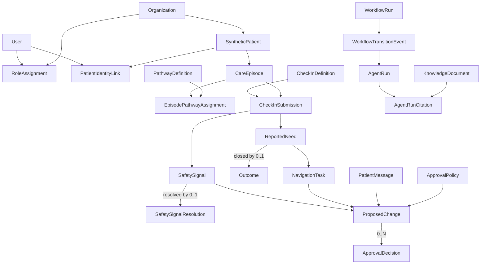

# Oncology Domain Schema Reconciliation

**Design specification**

**Date:** August 18, 2026

**Status:** Approved for implementation planning

**Canonical product design:** [`docs/product-design.md`](../../product-design.md), especially §8.1–§8.14

**Reconciliation baseline:** Product-design commit `917f449`; this specification and its identity clarification ship together.

## 1. Purpose

Tasks 1–5 established the public demo, tenant-aware repositories, immutable check-in snapshots, FHIR-shaped export, deterministic need creation, and the navigator queue. Their simplified first migration no longer expresses the approved domain model.

This specification defines the migration boundary between that working baseline and the reconciled production-capable schema. It supersedes the original implementation plan's Tasks 6–12. The migration must replace contradictory relationships; it must not preserve obsolete columns through permanent dual writes.

The public environment remains synthetic and reproducible. Explicit Alembic migrations and upgrade tests are still required, but preserving disposable seed rows is less important than reaching one coherent schema.

## 2. Architectural rule

Terminal state is established by inserting the immutable record that authorizes it, never by writing a terminal value to an aggregate's status column.

- `Outcome` closes `ReportedNeed`.
- `SafetySignalResolution` resolves `SafetySignal`.
- An approved `dismiss_signal` ProposedChange dismisses `SafetySignal`.
- Corrections, reopenings, escalations, and proposal edits create successor rows.
- Application reads use canonical derived-state views.
- Organization-scoped references use composite tenant-aware foreign keys.
- Closed, enumerable authorization targets use real foreign keys.
- `AuditEvent` is the only polymorphic reference and cannot authorize mutation.

## 3. Relationship map



## 4. Identity, tenancy, and historical authority

`User` is a platform identity and does not belong to exactly one organization. `primary_organization_id` is nullable and is only a user-interface preference. The active session selects one organization, and every authorization operation receives it explicitly.

`RoleAssignment` contains `organization_id`, `user_id`, role, `granted_at`, and nullable `revoked_at`. Rows are retained after revocation; re-granting creates another row. Revocation may not be silently backdated. Approval qualification requires:

1. The assignment belongs to the authorizing user.
2. The assignment organization equals the proposal organization.
3. `authorized_at` falls within the grant interval.
4. The role satisfies the proposal's snapshotted required role.

`PatientIdentityLink` is the explicit bridge between one platform User and one SyntheticPatient inside an organization. It replaces the current accidental equality between user IDs and patient IDs. The link records `linked_at` and nullable `revoked_at`; partial unique indexes permit at most one non-revoked link per user and per synthetic patient. The patient demo session carries both identifiers after validating this link. Proxy access is a separate future authorization relationship.

## 5. Pathways, submissions, and corrections

`EpisodePathwayAssignment` replaces the direct pathway foreign key on CareEpisode. It records the exact pathway version, `effective_from`, nullable `effective_to`, migration reason, and author.

```sql
CHECK (effective_to IS NULL OR effective_from < effective_to)

EXCLUDE USING gist (
  organization_id WITH =,
  care_episode_id WITH =,
  tstzrange(effective_from, effective_to, '[)') WITH &&
)
```

The exclusion constraint requires `btree_gist`. Adjacent half-open intervals are valid; overlaps are not.

`CheckInSubmission` is submitted data only. Draft data remains client-side in the public demo; future server drafts use `CheckInDraft`. Each submission records organization, patient, care episode, exact CheckInDefinition version, immutable answers and labels, `submission_source`, authorship, import provenance where applicable, and submission timestamp.

`submission_source` values are `patient`, `authorized_proxy`, `clinician`, and `import`. Human submissions require `submitted_by_user_id`; imports require external provenance. Patient authorship is validated through PatientIdentityLink.

Corrections create a new submission with `supersedes_submission_id UNIQUE`. A predecessor remains active until a submitted successor exists. `active_check_in_submission` is the only counting and current-read predicate.

## 6. Needs, tasks, and outcomes

ReportedNeed has exactly one origin:

```sql
CHECK (num_nonnulls(source_submission_id, reopened_from_need_id) = 1)
```

`reopened_from_need_id` is unique, tenant-, patient-, and episode-safe. Reopening creates a new need and does not copy or reactivate tasks.

Stored need states are `open` and `in_progress`. The first assignment or task start advances the need; creating an unassigned task does not. `effective_need_state` returns `closed` when an Outcome exists.

NavigationTask always belongs to a ReportedNeed. States are `open`, `assigned`, `in_progress`, `completed`, and `cancelled`; completed and cancelled are irreversible terminal states. Cancellation records actor, time, and controlled reason.

`Outcome.reported_need_id` is `NOT NULL UNIQUE`. ReportedNeed has no `outcome_id`, `closed_at`, or stored closed state. Outcome records the authorized human, timestamp, disposition, and note.

One authoritative Outcome-insert trigger locks the need and its non-terminal tasks, cancels those tasks with `need_closed`, attributes each cancellation to the Outcome recorder and timestamp, and emits one AuditEvent per task. Separate database guards reject task creation, assignment, or restart when an Outcome exists. `need_closed` cancellations are excluded from abandonment-quality metrics.

## 7. Safety signals

SafetySignal has exactly one origin:

```sql
CHECK (num_nonnulls(source_submission_id, escalated_from_signal_id) = 1)
```

`escalated_from_signal_id` is unique. Every signal references a versioned SignalRule with `rule_kind` equal to `deterministic` or `human_escalation`. Human recovery creates a new signal using the registered human-escalation rule identity.

`deterministic_level` is immutable and ordinal. `effective_level` is the materialized current level. Automation cannot lower the effective level below the deterministic baseline.

Stored active signal states are `open` and `acknowledged`; acknowledgement requires user and timestamp together. `SafetySignalResolution` is append-only with `safety_signal_id NOT NULL UNIQUE`, resolver, time, and required reason. Resolution requires prior acknowledgement and does not use approval machinery.

Dismissal requires prior acknowledgement and an applied `dismiss_signal` proposal. `dismissal_proposed_change_id` points to the proposal authorization unit. Severity overrides form `0..N` proposal history; `current_severity_override_proposed_change_id` is only the materialized latest pointer.

Resolution insertion and final dismissal approval both lock the SafetySignal with `SELECT ... FOR UPDATE`, then reject the competing terminal record. `effective_safety_signal_state` derives dismissed, resolved, acknowledged, or open. Dual terminal records are an integrity failure, not a precedence rule.

## 8. Proposals, policies, and decisions

`ApprovalPolicy` is organization-, change-type-, and version-specific, with effective dates, deterministic-severity threshold where applicable, self-approval permission, required approval count, and required approver role.

`ProposedChange` is immutable and contains exactly one proposer, one fine-grained change type, the proposed JSONB value, rationale, value-schema identity/version, `supersedes_proposed_change_id UNIQUE`, explicit target foreign key, and snapshots of all resolved policy values.

The first-release change types and targets are:

| Change type | Target |
|---|---|
| `dismiss_signal` | `safety_signal_id` |
| `override_signal_severity` | `safety_signal_id` |
| `authorize_navigation_task` | `navigation_task_id` |
| `authorize_patient_message` | `patient_message_id` |

Exactly one target is required with `num_nonnulls`. One CASE constraint maps every enum value to its permitted column. Matching composite parent keys and foreign keys enforce target and tenant alignment. There is no `target_field`.

SafetySignal proposal links use the parent key `UNIQUE (proposed_change_id, safety_signal_id, organization_id, change_type)`. Both `dismissal_proposed_change_id` and `current_severity_override_proposed_change_id` use composite foreign keys to that key and are individually unique, so one proposal cannot be applied to more than one signal. The dismissal pointer is immutable; the current-override pointer is only a materialized latest-value convenience.

The revision-insert trigger locks the predecessor and permits a successor only when organization, target, and change type match and the predecessor is pending or declined. Approved, applied, or already-superseded proposals cannot be revised.

ApprovalDecision contains proposal, organization, authorizer, qualifying RoleAssignment, `approved|declined`, timestamp, role snapshot, and reason. Proposed and final values do not appear on decisions. Decline reason is required. `UNIQUE (proposed_change_id, authorized_by_user_id)` prevents duplicate counting.

`effective_proposed_change_state` derives superseded, declined, approved, or pending in that order. Any qualifying decline is immediately terminal. Decisions are accepted only while a proposal is current and pending.

Dismissal policy evaluates immutable deterministic severity. Below threshold, snapshotted organization policy may permit one qualified self-approval. At or above threshold, two distinct qualified human approvals are required and the proposer cannot count. Agents cannot propose or approve dismissal.

The final-approval trigger locks proposal and target, recomputes eligibility from the policy snapshot, and atomically applies dismissal or severity override. A proposal—not an arbitrary decision row—is the authorization unit.

## 9. Workflow, knowledge, resources, and audit

WorkflowRun is the durable instance and stores materialized current state. WorkflowTransitionEvent is append-only and records every actual transition and actor. AgentRun optionally belongs to a transition; one transition may contain multiple agent runs. ManualReviewTask is operational recovery work and is never substituted for a patient NavigationTask.

Resource is organization-scoped. NavigationTaskResource preserves the resource facts proposed with a task. Resource approval is part of `authorize_navigation_task`; delivered is a later operational event.

KnowledgeDocument versions are immutable. OrganizationKnowledgeApproval controls which exact versions may be retrieved. Withdrawal blocks future use but does not rewrite existing AgentRunCitation rows. Citations retain exact version and passage.

AuditEvent is append-only and the only polymorphic target. It uses required `actor_type = user|agent|policy|system` and a CASE constraint that requires exactly the matching identity form. Policy and system component names and versions must be nonblank. Audit targets never authorize state change.

## 10. Immutability and recovery

The application role has no UPDATE or DELETE privilege on CheckInSubmission, ProposedChange, ApprovalDecision, Outcome, SafetySignalResolution, AuditEvent, or WorkflowTransitionEvent. BEFORE UPDATE OR DELETE triggers raise exceptions as a second backstop.

The restore integrity command must fail on:

- Closed needs with non-terminal tasks
- Tasks created, assigned, or restarted after closure
- Missing task-cancellation AuditEvents or incorrect closer attribution
- Signals with both resolution and dismissal
- Applied proposals lacking current qualifying approvals
- Cross-organization approval qualification
- Invalid AuditEvent actor shapes
- Overlapping pathway intervals
- Forked submission, need-reopening, signal-escalation, or proposal-revision chains

It reports violations and never fabricates authorization or silently chooses a terminal state.

This audit is mandatory after restores, ETL, or bulk loads that use `session_replication_role = replica`, because that setting can disable the lifecycle triggers and creation guards.

## 11. FHIR R4 boundary

- Immutable submissions map to distinct QuestionnaireResponse resources.
- Superseded responses render `amended`; the correction edge uses Provenance.entity role `revision` because QuestionnaireResponse has no `relatesTo` in R4.
- Patient-supplied answers map to tagged Observation resources.
- SafetySignal maps to a profiled DetectedIssue. Resolution uses mitigation; dismissal and dual severity use declared extensions.
- Applied proposals and their complete qualifying decision sets map to Provenance with separately typed proposer and authorizer agents.
- Pending, declined, and superseded proposals, internal AuditEvent, and ManualReviewTask remain internal.

## 12. Acceptance criteria

- Alembic upgrades an empty database and the Task-5 schema to the reconciled head.
- The initial `0001_core_domain.py` migration remains immutable.
- All ORM metadata matches explicit migrations, views, indexes, constraints, and triggers.
- Existing patient check-in and navigator queue behavior survives through adapted repositories and APIs.
- Every tenant-sensitive relationship is proven by negative cross-organization tests.
- PostgreSQL concurrency tests prove that only one competing signal terminal path commits.
- Append-only records reject UPDATE and DELETE for the application role.
- The restore integrity command detects every listed violation.
- Generated OpenAPI and web types reflect the reconciled patient and navigator contracts.
- The public synthetic seed resets successfully under the new schema.
